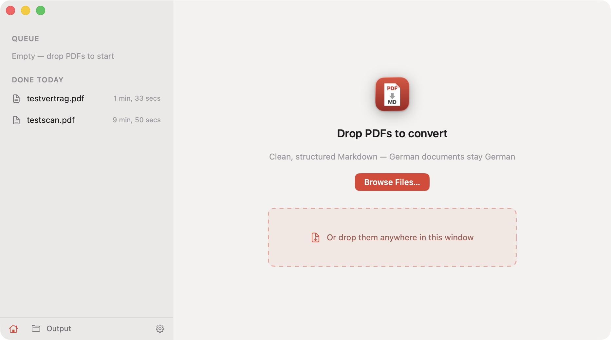
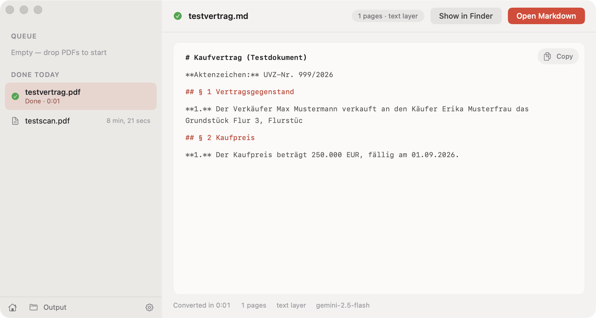

# PDF to MD AI Converter

A small native macOS app that converts PDFs into clean, structured Markdown. Built for German legal and insurance documents (contracts, Grundbuchauszüge, notarial deeds), but works on any PDF.

Drop a PDF on the window or Dock icon, get a `.md` file in your output folder.





## Features

- Drag and drop one or many PDFs, sequential queue with live progress
- PDFs with a text layer: one AI call produces a structured summary that mirrors the document's section numbering (§1, §2, ...)
- Scanned PDFs (no text layer): per-page OCR via Gemini Vision, faithful Markdown transcription including tables, stamps, and signatures
- Per-file cancel, retry on failure, clear error messages
- Cost guard: scanned documents over 100 pages ask before converting
- Output language stays the original (German documents stay German)
- Automatic updates (Sparkle): the app offers new versions on launch

**New here? Follow the [step-by-step setup guide](SETUP.md).**

## Install

1. Download the newest `PDFConverter-x.y.zip` from the [latest release](../../releases/latest)
2. Unzip and drag `PDFConverter.app` to `/Applications` (the app is notarized by Apple, it opens without warnings)
3. Get an OpenRouter API key at [openrouter.ai/keys](https://openrouter.ai/keys)
4. Open the app, press Cmd+, (Settings), paste the key, and click "Test Key"

Updates arrive automatically: the app checks on launch and asks before installing.

Converted files land in `~/Documents/PDF-Converted/` (changeable in Settings).

## Privacy note

The full content of every PDF you drop is sent to Google Gemini for processing. With the default OpenRouter backend, routing goes through OpenRouter (US). Do not convert documents containing customer or otherwise confidential data unless that is cleared for your use case.

For EU processing, switch the backend to **Vertex AI (EU)** in Settings: content then goes directly to Google Vertex AI in europe-west1. You need access to a GCP project with the Vertex AI API enabled. Run `gcloud auth application-default login` once, then paste the JSON from `~/.config/gcloud/application_default_credentials.json` into Settings along with the project ID, and click "Test Connection".

## Build from source

Requires Xcode command line tools (macOS 14+).

```bash
git clone <this repo>
cd pdf-converter-app
./scripts/build-app.sh        # builds ad-hoc signed PDFConverter.app
open PDFConverter.app
```

Tip: if `OPENROUTER_API_KEY` is set in your shell and you start the binary once from the terminal (`./PDFConverter.app/Contents/MacOS/PDFConverter`), the app imports the key into your Keychain automatically.

Maintainer release (notarize, EdDSA-sign, appcast, upload, GitHub release):

```bash
./scripts/release.sh 1.2
```

## Settings

- **Model**: Gemini 2.5 Flash (default, fast and cheap) or Gemini 2.5 Pro for complex contracts
- **Prompt**: the extraction instruction is editable if you want a different output style
- **Output folder**: anywhere you like

## License

MIT
